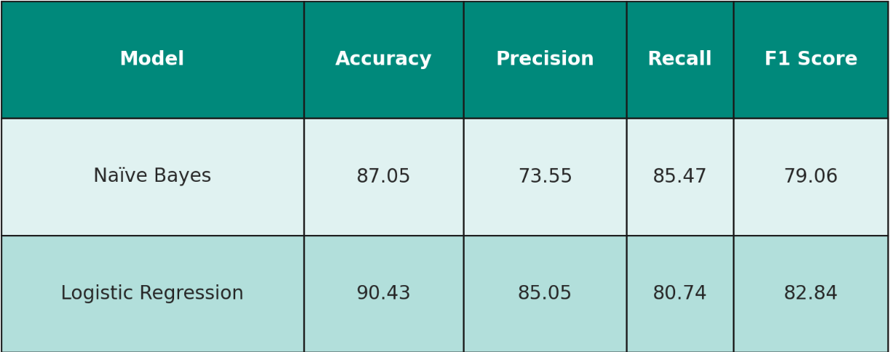
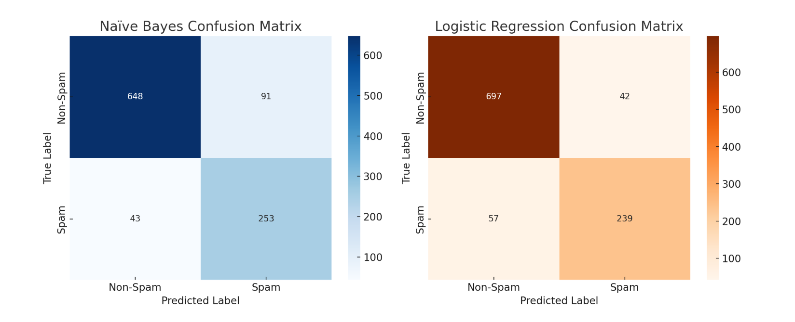
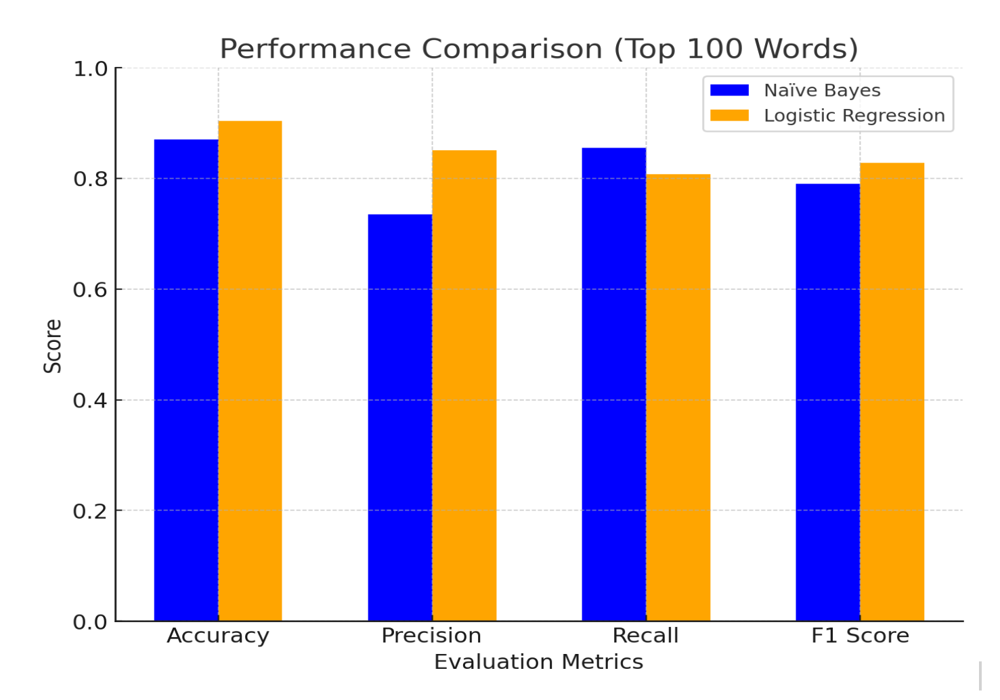
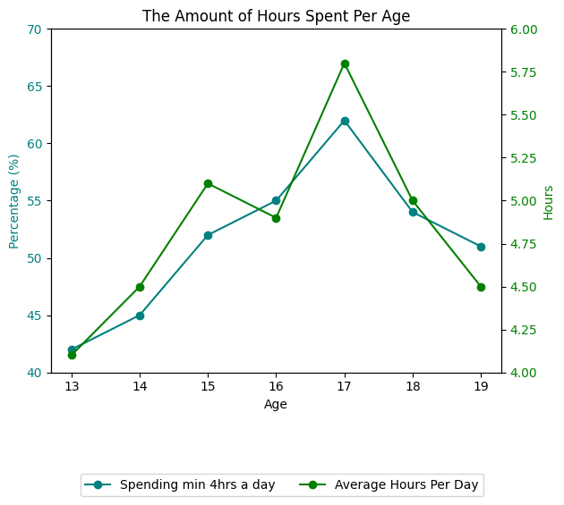

# Wale's Portfolio

# Project 1: Evaluating Naïve Bayes vs. Logistic Regression for Email Spam Detection
Spam emails pose security threats and disrupt communication. This project compares Naïve Bayes and Logistic Regression models to determine which performs best for spam detection.

### Research Question
"How effectively can machine learning models distinguish spam from legitimate emails, and which algorithm performs best?"

### Dataset
- **Source:** [Email Spam Classification Dataset (Kaggle)](https://www.kaggle.com/datasets/balaka18/email-spam-classification-dataset-csv)
- **Format:** CSV with email text and spam/ham labels.
### Methods 
- Naïve Bayes is efficient for text classification and works well with probability-based decision-making.
- Logistic Regression is a powerful linear model that performs well in binary classification tasks.

### Data Preprocessing 
- Text Cleaning: Removed special characters, stop words, and converted text to lowercase.
- Tokenization: Split email text into words.
- Vectorization: Used TF-IDF (Term Frequency-Inverse Document Frequency) to convert text into numerical format.

### Results
#### Model Performance Comparison

#### Confusion Matrices

#### Model Performance Graph Comparison

# Project 2: Analyzing the Financial Impact of Viral Social Media Content on Sales
This project explores how viral social media content influences product sales, focusing on platforms like TikTok and Instagram. Using Python for data processing and analysis, the project investigates demographic patterns, engagement metrics, and platform-specific trends to quantify the financial impact of viral campaigns.

### Key Features:
* Platform Insights: TikTok's dominance in driving product purchases (e.g., 49% conversion rate).
* Engagement Trends: Relationships between likes, shares, views, and sales.
* Demographics: Analysis of teen usage patterns and income group preferences.

### Objectives:
* To quantify the financial impact of viral TikTok videos on product sales (e.g., Dyson Airwrap and Shark Flexstyle).
* To analyze consumer engagement patterns and their contributions to sales.
* To identify challenges in predicting viral content success and strategies for improvement.

### Methodology
1. **Data Collection**:
   - Processed social media engagement data using Google Colab and Python.
   - Organized demographic and platform usage data.

2. **Data Cleaning**:
   - Removed irrelevant or misaligned data entries.
   - Categorized data by platform, usage, and engagement metrics.

3. **Analysis**:
   - Conducted descriptive statistics to explore trends.
   - Created visualizations to understand engagement patterns.

### Key Insights
- TikTok drives 49% of users to purchase a product after viewing viral content.
- Viral campaigns significantly boost sales, as seen with Stanley's 275% increase post-viral video.
- Engagement metrics like views, likes, and shares directly correlate with sales.
- Demographics play a role: TikTok is popular among teens, while Instagram targets higher-income users.

### Visualizations
#### 1. Average Hours Spent Per Age Group

#### 2. Platform Usage Trends

### Results
Average Hours Spent Patterns:
- Teenagers aged 13–17 spend an average of 4–6 hours daily on social media, peaking at age 17 (5.8 hours/day).
- 62% of 17-year-olds spend at least 4 hours daily, the highest across all ages.
- Engagement drops beyond age 17, with 19-year-olds averaging 4.5 hours/day, and 51% spending 4+ hours daily.
- Mid-teen years represent peak engagement, offering prime opportunities for targeting this demographic.
  
Platform Usage Patterns:
- YouTube (93%) dominates among teens (13-17), especially females, with "Almost Constant" use.
- TikTok (63%) is highly favored by Gen Z, with frequent daily use, particularly by males. Its short-form content makes it a hub for viral opportunities.
- Instagram (59%) and Snapchat (60%) are popular among female teens, supporting frequent engagement.
- Facebook (45%), mostly used by males aged 18-24, shows declining popularity among younger teens.
  
Marketing Impact:
- Viral Content Drives Sales: Platforms like TikTok boost brand visibility and drive sales through viral trends.
- Competitive Edge: Businesses that excel on TikTok can dominate in industries like fashion, beauty, and gaming.
- Effective Marketing: Social media remains the most impactful marketing strategy, particularly for engaging Gen Z.
- Time on Social Media: Teens spend increasing hours on platforms, peaking at 62 hours/month by age 17, before tapering off post-teen years.

### Project Outcomes
In this project, I analyzed the financial impact of viral social media content on product sales, focusing on platforms like TikTok and Instagram. Using Python for data processing and analysis, I identified key trends, such as TikTok's ability to drive conversions, with 49% of users making purchases after encountering viral content. This analysis was supported by data cleaning, demographic segmentation, and visualization techniques to uncover actionable insights.

My work demonstrated that viral marketing is not just about creating trends it’s a measurable strategy that businesses can leverage to increase engagement and revenue. For example, the analysis revealed a 275% increase in Stanley’s sales following a viral TikTok video, underscoring the platform's influence on consumer behavior.

### Future Directions
- Examine long-term effects of viral content on sales.
- Analyze cross-platform campaigns for better synergy.
- Study the role of influencers versus organic posts.
