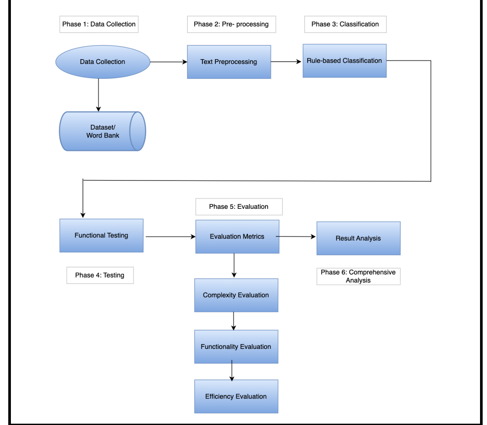
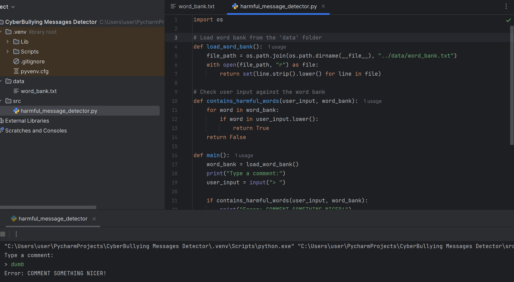
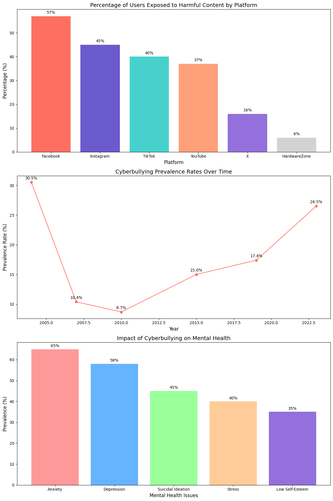
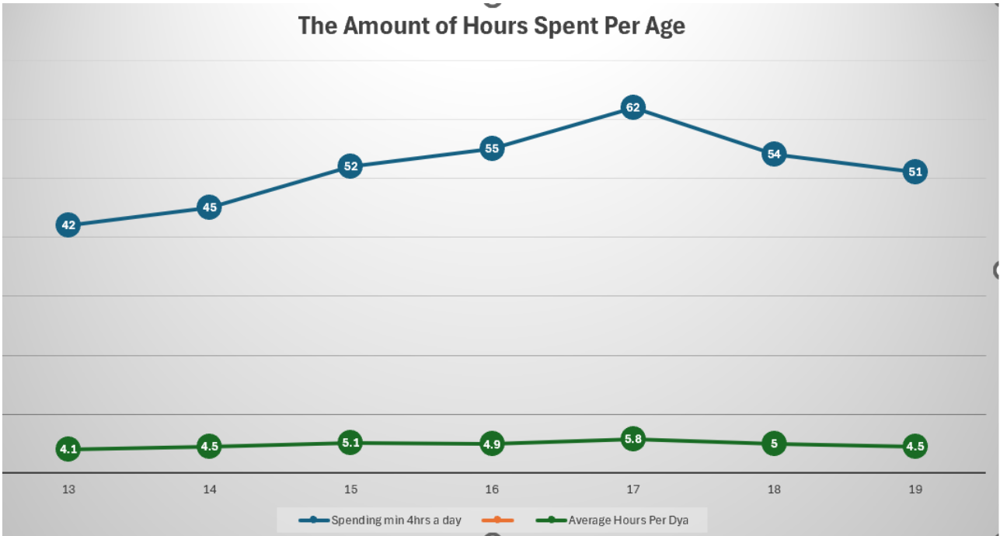
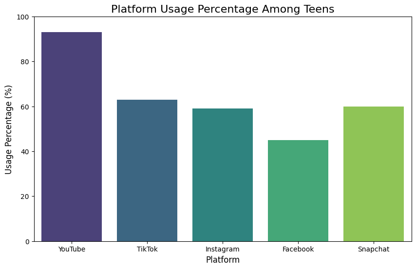

# Wale's Portfolio

# Project 1: Cyber Bullying Detection System
This is a capstone project I completed in the final year of my Bachelor's degree in Information Technology. I developed a Python-based system that identifies and prevents harmful online messages, such as hate speech and threats, to promote safer and more respectful interactions on social media platforms.

### Highlights:

* Technology: Python, Natural Language Processing (NLP), and Machine Learning (LSTM models).
* Focus: Detect and block messages containing hate speech, threats, or mocking.
* Interactivity: Provides real-time feedback to users on flagged messages.
  
### Technical Architecture of the Detection System 
This diagram illustrates the six-phase workflow of the detection system, highlighting data collection, pre-processing, classification, testing, evaluation, and comprehensive analysis to create a safer online environment.

### Core Functionality Code: Harmful Message Detection System 
This script implements the primary functionality of the Cyberbullying Detection System by:

* Loading a Custom Word Bank: Reads a pre-defined set of harmful or offensive words stored in a word_bank.txt file.
* User Input Validation: Accepts user comments and checks them against the word bank to identify potentially harmful content.
* Real-Time Feedback: Provides immediate feedback by alerting users to rephrase their comments if harmful words are detected.
  
### Visualization of Cyberbullying Trends and Impacts 
I used Python to analyze data on cyberbullying trends and impacts, leveraging libraries like Matplotlib and Seaborn to create visualizations. The graphs display key insights, such as the prevalence of harmful content across platforms, trends in cyberbullying incidents over time, and its effects on mental health.

Graph 1: Percentage of Users Exposed to Harmful Content
* Source: Ministry of Digital Development and Information (MDDI) Online Safety Poll (2024).
* Insight: Facebook leads with 57% of users encountering harmful content, followed by Instagram (45%) and TikTok (40%).

Graph 2: Cyberbullying Prevalence Rates Over Time
* Source: Studies by Patchin & Hinduja, CDC, and others.
* Insight: Cyberbullying rates have risen over time, with spikes in 2015 and 2023.

Graph 3: Impact on Mental Health
* Source: Frontiers in Psychology (2024).
* Insight: Anxiety (65%) and depression (58%) are the most common impacts, highlighting the psychological toll of cyberbullying.

Overall Process
* Data Collection: Gathered data from government surveys, academic studies, and longitudinal reports.
* Data Cleaning: Extracted relevant statistics and ensured consistency across sources.
* Visualization: Created clear and informative charts using Python libraries (Matplotlib and Seaborn) to depict trends and impacts effectively.

### Project Outcomes
The Cyberbullying Detection System successfully demonstrated its ability to identify and prevent harmful online interactions. Key outcomes include:

* Efficient Detection: High accuracy in identifying harmful words or phrases in user-generated content.
* Real-Time Feedback: Immediate notifications for users to rephrase harmful comments, fostering positive interactions.
* Promoting Safer Online Spaces: Showcased the potential to mitigate cyberbullying on social media platforms.

### Future Scope
To enhance and scale the system, the following improvements are suggested:

* Machine Learning Integration: Implement algorithms for better context-based detection.
* Multilingual Support: Expand detection to multiple languages for global applicability.
* Platform Scalability: Optimize the system for handling large data volumes on social media platforms.
* Social Media Integration: Enable seamless integration with social media APIs for broader adoption.

# Project 2: Analyzing the Financial Impact of Viral Social Media Content on Sales
This project explores how viral social media content influences product sales, focusing on platforms like TikTok and Instagram. Using Python for data processing and analysis, the project investigates demographic patterns, engagement metrics, and platform-specific trends to quantify the financial impact of viral campaigns.

### Key Features:
* Platform Insights: TikTok's dominance in driving product purchases (e.g., 49% conversion rate).
* Engagement Trends: Relationships between likes, shares, views, and sales.
* Demographics: Analysis of teen usage patterns and income group preferences.

### Objectives:
* To quantify the financial impact of viral TikTok videos on product sales (e.g., Dyson Airwrap and Shark Flexstyle).
* To analyze consumer engagement patterns and their contributions to sales.
* To identify challenges in predicting viral content success and strategies for improvement.

### Methodology
1. **Data Collection**:
   - Processed social media engagement data using Google Colab and Python.
   - Organized demographic and platform usage data.

2. **Data Cleaning**:
   - Removed irrelevant or misaligned data entries.
   - Categorized data by platform, usage, and engagement metrics.

3. **Analysis**:
   - Conducted descriptive statistics to explore trends.
   - Created visualizations to understand engagement patterns.

### Key Insights
- TikTok drives 49% of users to purchase a product after viewing viral content.
- Viral campaigns significantly boost sales, as seen with Stanley's 275% increase post-viral video.
- Engagement metrics like views, likes, and shares directly correlate with sales.
- Demographics play a role: TikTok is popular among teens, while Instagram targets higher-income users.

### Visualizations
#### 1. Average Hours Spent Per Age Group

#### 2. Platform Usage Trends

### Results
Platform Usage Patterns:
- YouTube (93%) dominates among teens (13-17), especially females, with "Almost Constant" use.
- TikTok (63%) is highly favored by Gen Z, with frequent daily use, particularly by males. Its short-form content makes it a hub for viral opportunities.
- Instagram (59%) and Snapchat (60%) are popular among female teens, supporting frequent engagement.
- Facebook (45%), mostly used by males aged 18-24, shows declining popularity among younger teens.
  
Marketing Impact:
- Viral Content Drives Sales: Platforms like TikTok boost brand visibility and drive sales through viral trends.
- Competitive Edge: Businesses that excel on TikTok can dominate in industries like fashion, beauty, and gaming.
- Effective Marketing: Social media remains the most impactful marketing strategy, particularly for engaging Gen Z.
- Time on Social Media: Teens spend increasing hours on platforms, peaking at 62 hours/month by age 17, before tapering off post-teen years.

### Future Directions
- Examine long-term effects of viral content on sales.
- Analyze cross-platform campaigns for better synergy.
- Study the role of influencers versus organic posts.
